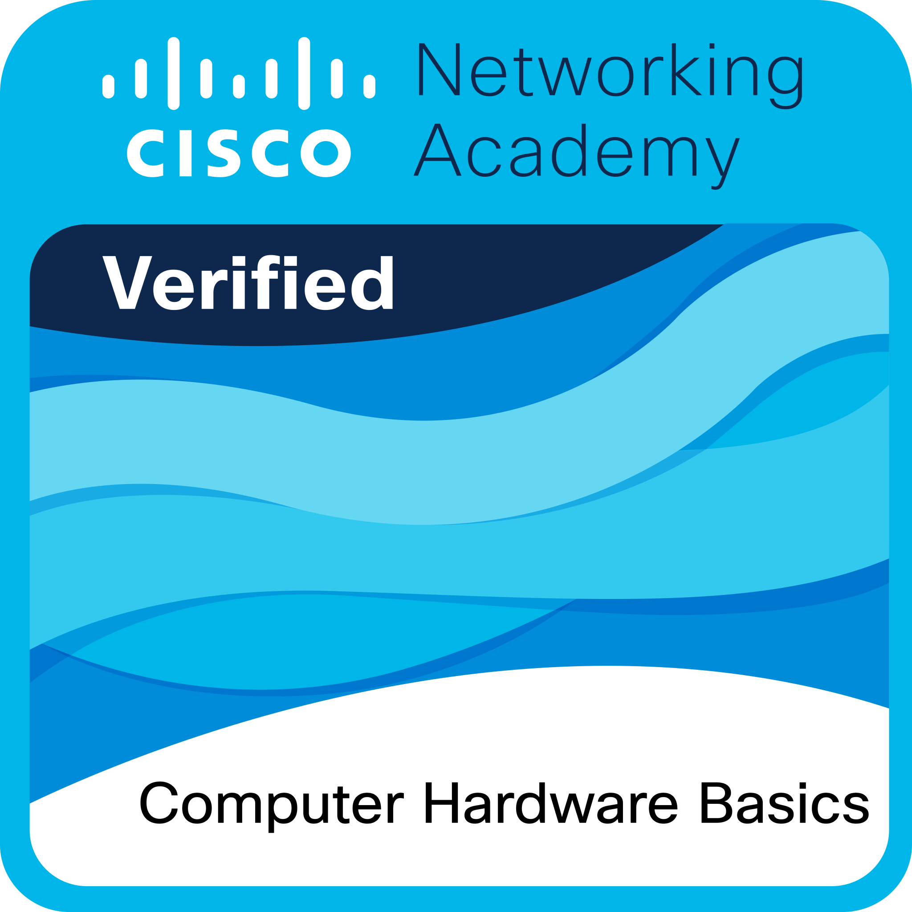

## Certifications & Badges

### Cisco Networking Academy – Computer Hardware Basics

**Completed:** September 2026
🔗 [Verify badge](https://www.credly.com/badges/beb33241-36ba-4768-87f4-dfe7df80be2c/public_url)

A foundational course covering computer components, assembly/disassembly, and basic troubleshooting.
